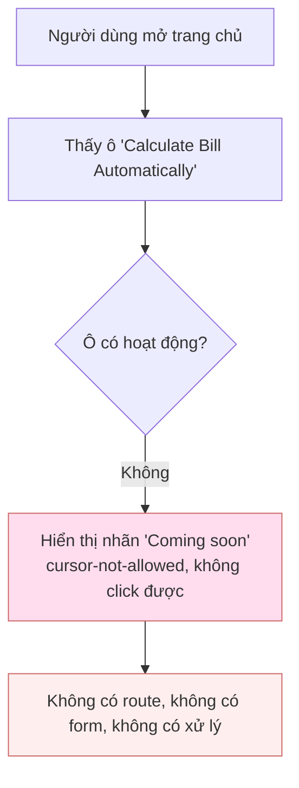

# Hướng dẫn làm báo giá

> **Trạng thái tài liệu:** Khảo sát ngày 2026-08-30 trên nhánh `main`.
>
> **KẾT LUẬN QUAN TRỌNG — đọc trước tiên:**
> Sau khi khảo sát toàn bộ codebase (frontend, server actions, database schema,
> migrations, i18n, seed/test), **chức năng "làm báo giá" (quotation) hiện KHÔNG
> tồn tại trong project này.** Không có bảng dữ liệu, API, service, form, logic
> tính giá, thuế, chiết khấu hay trạng thái báo giá nào được triển khai.
>
> Dấu vết duy nhất liên quan là **một nút "Calculate Bill Automatically" trên
> trang chủ, được đánh dấu "Coming soon" (Sắp ra mắt)** — đây chỉ là ô giao diện
> tĩnh, không có route, không có xử lý.
>
> Tài liệu này vì vậy mô tả **trung thực trạng thái hiện tại** thay vì mô tả một
> quy trình không tồn tại. Những chỗ codebase không có thông tin đều được đánh
> dấu **"Chưa xác định từ codebase"** hoặc **"Chưa được triển khai"**. Không có
> business rule nào được suy diễn.

---

## 1. Tổng quan

### Báo giá dùng để làm gì
**Chưa được triển khai.** Trong project không có bất kỳ định nghĩa nghiệp vụ nào
về báo giá. Không thể mô tả mục đích từ codebase.

### Phạm vi của module
Module báo giá **không tồn tại**. Project `tp-internal-tool` hiện là một **portal
nội bộ** gồm các module sau (xác định từ cấu trúc `app/(app)` và schema):

| Module | Mô tả | Vị trí |
|---|---|---|
| Documents | Quản lý tài liệu PDF đã ký theo client/project | `app/(app)/documents`, `app/actions/documents.ts` |
| Academy | Khóa học đào tạo nội bộ (video, quiz, ghi chú) | `app/(app)/academy`, `app/actions/academy.ts` |
| Admin | Quản trị người dùng, clients, projects, hoạt động | `app/(app)/admin`, `app/actions/{users,clients,projects}.ts` |
| Profile | Thông tin cá nhân, đổi mật khẩu | `app/(app)/profile`, `app/actions/profile.ts` |

Không có module nào trong số này xử lý báo giá, giá bán, sản phẩm hay hóa đơn tài chính.

### Các đối tượng liên quan (nếu sau này xây dựng báo giá)
Đây là các thực thể **hiện có** mà một tính năng báo giá trong tương lai *có thể*
sẽ tham chiếu. Liệt kê ở đây để tham khảo — **chúng KHÔNG phải là chức năng báo giá**:

- `clients` — khách hàng (id, name, code).
- `projects` — dự án, mỗi dự án thuộc một client.
- `documents` — tài liệu PDF, trong đó có một `doc_type` tên là `invoice` (Hóa đơn).
- `profiles` — người dùng và vai trò.

> **Lưu ý:** `doc_type = 'invoice'` chỉ là **một nhãn phân loại file PDF được
> upload** (xem `supabase/migrations/0001_init.sql:18` và `lib/documents/naming.ts:9`).
> Nó **không** liên quan đến việc tạo/tính toán hóa đơn hay báo giá.

---

## 2. Quy trình tổng thể

**Chưa được triển khai — không có quy trình báo giá trong codebase.**

Trạng thái hiện tại của "báo giá" trong hệ thống chỉ là một ô giao diện placeholder
trên trang chủ:

Toàn bộ luồng "UI → API → service → database" mà một quy trình báo giá thông
thường cần **đều chưa tồn tại**.

---

## 3. Chuẩn bị trước khi tạo báo giá

Vì chức năng chưa tồn tại, phần này chỉ liệt kê **dữ liệu hiện có trong hệ thống**
(không phải điều kiện tiên quyết của báo giá):

| Dữ liệu | Có sẵn trong hệ thống? | Ghi chú |
|---|---|---|
| Khách hàng (client) | Có — bảng `clients` | Quản lý tại `app/(app)/admin/clients` |
| Dự án (project) | Có — bảng `projects` | Mỗi project thuộc 1 client |
| Sản phẩm / hàng hóa / dịch vụ | **Không có** | Không có bảng product/service/item nào |
| Bảng giá / đơn giá | **Không có** | Không có bảng price/pricing nào |
| Thuế suất / VAT | **Không có** | Không có cấu hình thuế nào |
| Chiết khấu | **Không có** | Không có logic discount nào |

---

## 4. Các bước tạo báo giá

**Chưa được triển khai.**

Không có form tạo báo giá, không có server action tạo báo giá, không có API route
báo giá nào trong codebase. Không thể mô tả các bước từ code.

- Người dùng làm gì: Chưa xác định từ codebase.
- Nhập thông tin gì: Chưa xác định từ codebase.
- Hệ thống xử lý gì: Chưa xác định từ codebase.
- Kết quả nhận được: Chưa xác định từ codebase.
- Validation có thể gặp: Chưa xác định từ codebase.

---

## 5. Cách tính giá

**Chưa được triển khai.**

Không tìm thấy bất kỳ logic tính toán tiền tệ nào trong codebase:

- Không có công thức `Thành tiền = Số lượng × Đơn giá`.
- Không có logic chiết khấu.
- Không có logic tính VAT/thuế.
- Không có logic tính subtotal/total/phụ phí.
- Không có định dạng tiền tệ (không có `Intl.NumberFormat`, `toLocaleString` cho
  tiền, không có ký hiệu `VND`/`đồng` nào trong source).

> **Đã kiểm chứng:** grep toàn bộ `app`, `lib`, `components` với các từ khóa
> `currency`, `VND`, `đồng`, `amount`, `subtotal`, `discount`, `VAT`, `thành tiền`,
> `tổng tiền` — tất cả kết quả `total`/`amount` đều thuộc **phân trang** (đếm số
> bản ghi) hoặc **tiến độ khóa học** (done/total), không phải tiền.

Vì không có công thức thực tế trong code, tài liệu **không đưa ra công thức ví dụ**
để tránh bịa business rule.

---

## 6. Trạng thái báo giá

**Chưa được triển khai.** Không có enum, cột `status`, hay state machine nào cho
báo giá.

| Status | Ý nghĩa | Có thể chỉnh sửa? | Có thể chuyển trạng thái? |
|---|---|---|---|
| _(không có)_ | Chưa xác định từ codebase | Chưa xác định từ codebase | Chưa xác định từ codebase |

> Tham khảo: enum `status` **duy nhất** liên quan tới nghiệp vụ trong hệ thống là
> của **projects** (`'active' | 'archived'`, xem `0001_init.sql:164`) và của
> **courses** (`'draft' | 'published'`). Cả hai **không liên quan** đến báo giá.

---

## 7. Quyền và vai trò

Hệ thống **có** cơ chế role/permission tổng quát, nhưng **không có quyền nào riêng
cho báo giá** (vì chức năng chưa tồn tại).

Các vai trò hiện có (`lib/db/types.ts:7`, migrations `0016`/`0017`):

| Role | Quyền (tổng quát, KHÔNG liên quan báo giá) |
|---|---|
| `admin` | Toàn quyền quản trị: users, clients, projects, documents, academy. Xác định qua `is_admin()` trong RLS (`0001_init.sql:57`). |
| `manager` | Vai trò trung gian, bổ sung ở migration `0016_manager_role_enum.sql` / `0017_manager_role_rls.sql`. Chi tiết quyền: xem trực tiếp file RLS `0017`. |
| `employee` | Người dùng thường; truy cập theo `project_members` và `is_active_user()`. |

Quyền cụ thể cho hành động báo giá: **Chưa xác định từ codebase** (không tồn tại).

---

## 8. Các trường dữ liệu

**Chưa được triển khai.** Không có model/bảng báo giá nên không có trường dữ liệu
nào để liệt kê.

| Field | Ý nghĩa | Required | Nguồn dữ liệu | Validation |
|---|---|---|---|---|
| _(không có)_ | Chưa xác định từ codebase | — | — | — |

---

## 9. Export / In / Gửi báo giá

**Chưa được triển khai** cho báo giá.

Ghi chú tham khảo về khả năng hiện có của hệ thống (áp dụng cho **documents**,
không phải báo giá):

- Hệ thống có cơ chế **share link** cho tài liệu PDF đã upload (`share_links`,
  `folder_share_links`) — tạo link công khai có thời hạn (`app/actions/shares.ts`,
  `app/actions/folder-shares.ts`).
- Không có chức năng sinh PDF/Excel báo giá, không có template in báo giá, không có
  gửi email báo giá. **Chưa xác định từ codebase.**

---

## 10. Các business rules quan trọng

Về báo giá: **không có business rule nào tồn tại trong codebase.**

Để tránh hiểu nhầm, lưu ý các rule **có thật** nhưng thuộc module khác (không phải
báo giá):

- Chỉ tài liệu **đã ký** mới được lưu: `documents.signed_attested` bắt buộc `= true`
  (`0001_init.sql:217`).
- Tài liệu chỉ nhận **PDF**: `mime_type = 'application/pdf'` (`0001_init.sql:214`).
- Employee không thể tự nâng quyền/tự kích hoạt lại: trigger
  `prevent_profile_privilege_change` (`0001_init.sql:116`).

---

## 11. Edge cases và lỗi thường gặp

Không có edge case nào liên quan báo giá vì chức năng chưa tồn tại. **Chưa xác định
từ codebase.**

---

## 12. Technical Reference

Không có file nào triển khai báo giá. Dưới đây là các file **liên quan gián tiếp**
(hạ tầng mà một tính năng báo giá tương lai có thể dựa vào) và **placeholder hiện tại**:

**Placeholder "Calculate Bill Automatically" (dấu vết duy nhất của "báo giá"):**
- `app/(app)/page.tsx` — ô giao diện trên trang chủ, trạng thái "Coming soon",
  `cursor-not-allowed`, không phải link, không có xử lý (xem quanh dòng 59–83).
- `messages/vi.json` / `messages/en.json` — khóa i18n `Home.calculateBill`,
  `Home.calculateBillDesc`, `Home.comingSoon`.

**Hạ tầng dữ liệu hiện có (KHÔNG phải báo giá):**
- `supabase/migrations/0001_init.sql` — schema nền: `profiles`, `clients`,
  `projects`, `project_members`, `documents`, `share_links`, `activity_log`.
- `lib/db/types.ts` — TypeScript types cho toàn bộ bảng. **Không có type nào cho
  quotation/quote/price/product/tax.**
- `app/actions/clients.ts`, `app/actions/projects.ts` — CRUD client/project.
- `app/actions/documents.ts` — upload/quản lý tài liệu (bao gồm `doc_type='invoice'`).
- `lib/documents/naming.ts` — quy tắc đặt tên file, map `invoice → "Hóa đơn"`.
- `lib/auth/dal.ts` — lớp truy cập xác thực (`requireUser`, kiểm tra role).

**Cơ sở dữ liệu:** Supabase/Postgres, quản lý qua `supabase/migrations/*.sql`
(project **không** dùng Prisma; không có `prisma/schema.prisma`).

---

## 13. Ví dụ một quy trình hoàn chỉnh

**Không thể cung cấp.** Việc đưa ra một ví dụ báo giá hoàn chỉnh sẽ buộc phải bịa
ra dữ liệu và business logic không tồn tại trong hệ thống, vi phạm yêu cầu "không
tự bịa business rule". Sẽ bổ sung khi chức năng được triển khai thực tế.

---

## 14. Checklist

**Chưa áp dụng được** — chưa có chức năng báo giá để kiểm tra. Checklist sẽ được
viết khi có implementation thực tế.

---

## 15. Các điểm cần lưu ý (dành cho developer)

1. **Chức năng báo giá chưa được xây dựng.** Nếu được giao "làm tài liệu quy trình
   báo giá", cần xác nhận lại với người yêu cầu: quy trình này hiện **chưa tồn tại
   trong code**. Có thể tài liệu đang được viết *trước* khi tính năng được phát triển.

2. **Nút "Calculate Bill Automatically" chỉ là placeholder.** Nó nằm ở
   `app/(app)/page.tsx`, được thêm gần đây, gắn nhãn "Coming soon", không có route
   (`href`) và không click được. Đừng nhầm đây là tính năng đã hoạt động.

3. **`doc_type = 'invoice'` gây hiểu nhầm.** Đây là loại *tài liệu PDF upload*
   ("Hóa đơn"), không phải chức năng lập hóa đơn/báo giá. Đừng dựa vào nó để suy ra
   logic báo giá.

4. **Không có tầng dữ liệu tiền tệ.** Toàn hệ thống không có cột số tiền, không có
   định dạng tiền tệ, không có thuế/chiết khấu. Khi triển khai báo giá sẽ cần thiết
   kế schema mới từ đầu (sản phẩm/dịch vụ, đơn giá, dòng báo giá, thuế, trạng thái...).

5. **Nguồn sự thật của schema là `supabase/migrations/*.sql`;** `lib/db/types.ts`
   là bản chép tay phải giữ đồng bộ thủ công (xem chú thích đầu file). Khi thêm bảng
   báo giá, phải cập nhật cả hai.

---

### Phụ lục — Phương pháp khảo sát (để kiểm chứng lại)

Kết luận "không có chức năng báo giá" dựa trên:
- Duyệt cây thư mục `app/`, `lib/`, `components/`, `supabase/migrations/`.
- Đọc toàn bộ schema (`0001_init.sql`) và `lib/db/types.ts` (danh sách đầy đủ 20+ bảng).
- Grep không phân biệt hoa thường với các từ khóa: `quotation`, `báo giá`, `invoice`,
  `pricing`, `price`, `đơn giá`, `chiết khấu`, `VAT`, `thuế`, `subtotal`, `discount`,
  `billing`, `currency`, `VND`, `amount`, `total`, `tổng tiền`, `thành tiền`.
- Kiểm tra toàn bộ `app/actions/*` (9 server action files) — không file nào xử lý báo giá.

Nếu tính năng báo giá được thêm sau ngày khảo sát, tài liệu này cần được viết lại
dựa trên code thực tế.
